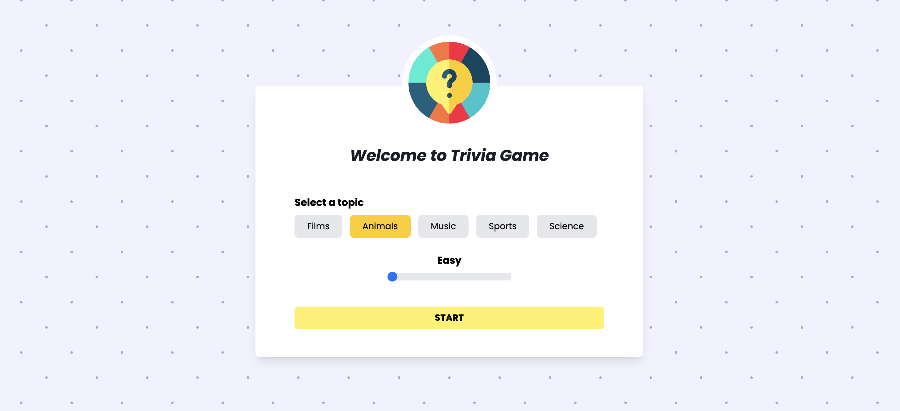
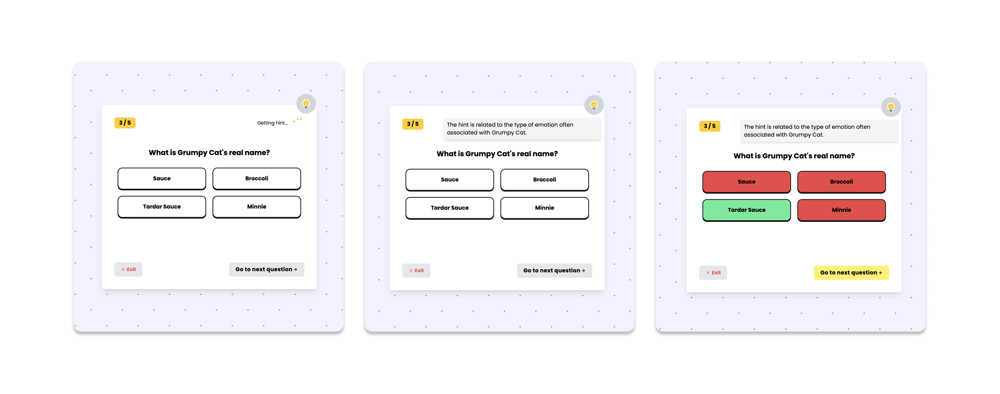

# Trivia Game

Enjoy a fun trivia game powered by Chat GPT 🤖

Choose from different categories, set the difficulty level and challenge yourself for a great time. You can also get hints whenever you need them to enhance your gameplay.

# Technologies used:
<ul>
  <li>React</li>
  <li>Redux</li>
  <li>Tailwind</li>
  <li><a href="https://openai.com/product" target="_blank">OpenAI API</a></li>
  <li><a href="https://opentdb.com/api_config.php" target="_blank">Open Trivia DB API</a></li>
</ul>

## Project view

# Update: now you can get hints!

Users can now get hints for each question by clicking on the top icon 💡

The hints are provided by chat GPT

# Next features:
<ul>
  <li>Set restrictions so users get only one hit per question</li>
  <li>Add new categories</li>
  <li>Improve design</li>
</ul>

# Other resources I used in this project:

I found the main quiz icon on <a href="https://icons8.com/" target="_blank">Icons8</a>

<a href="https://react-icons.github.io/react-icons/" target="_blank">React Icons</a> is also a nice choice to get modern icons!

